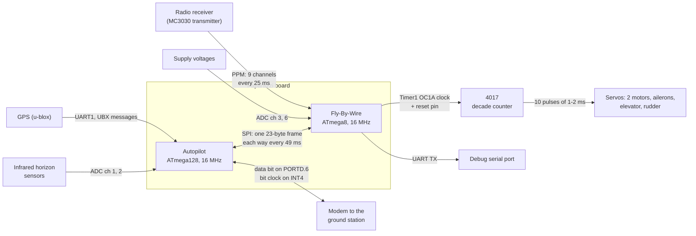
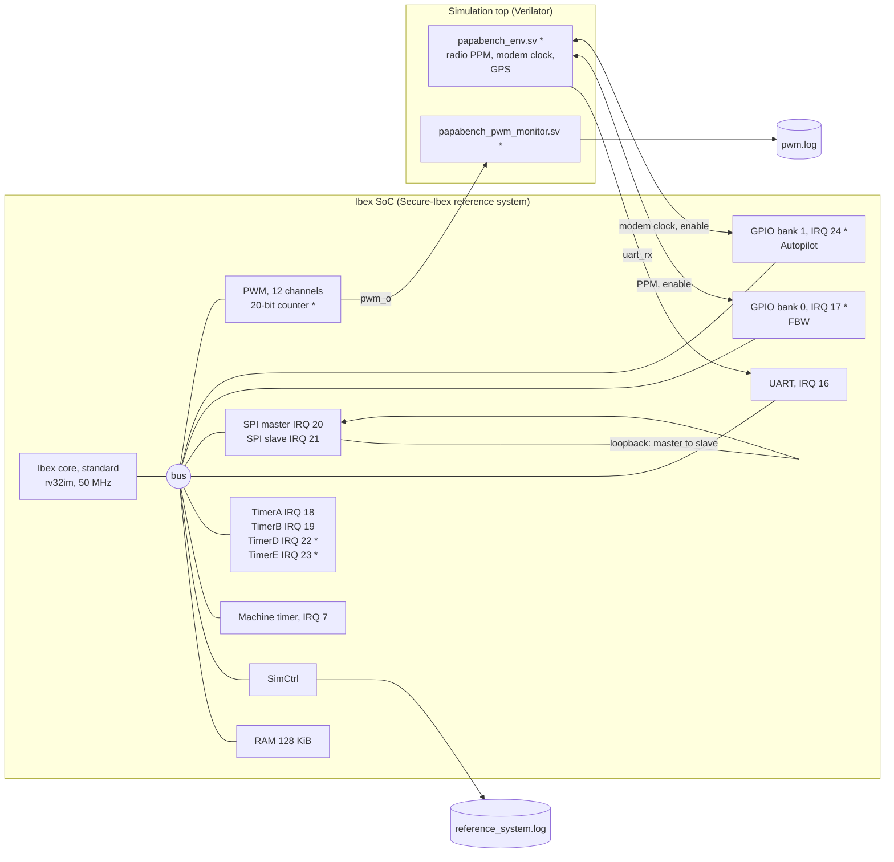
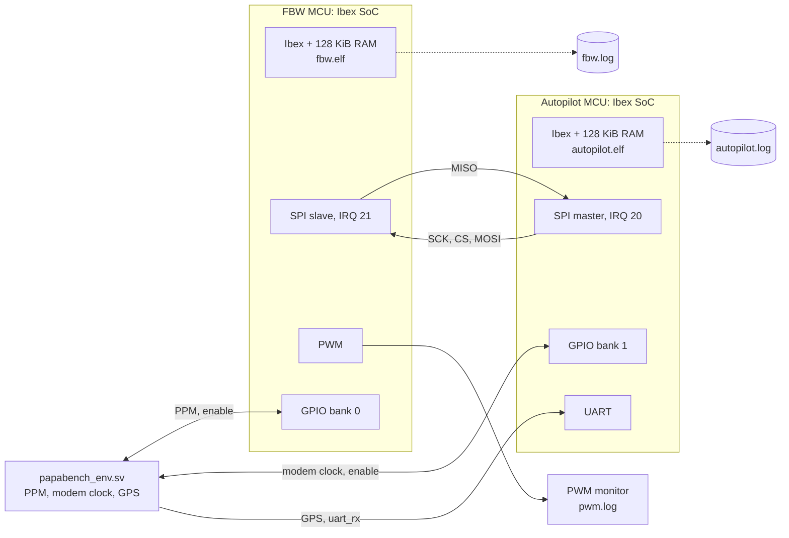
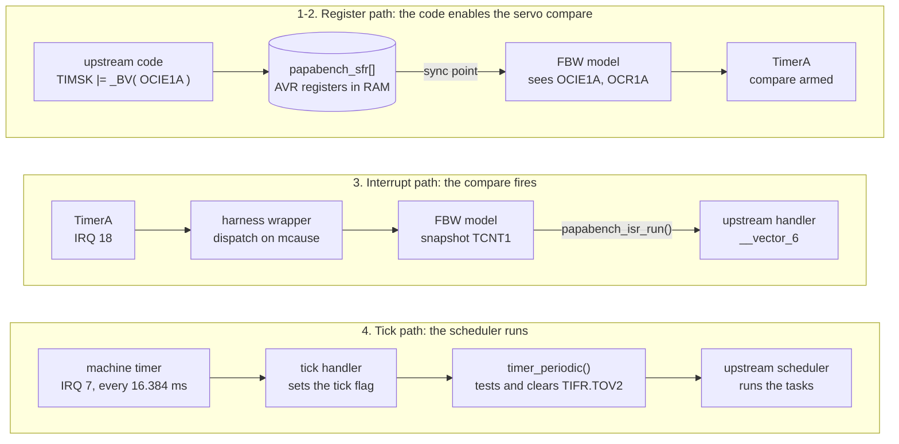

TACLeBench on Ibex — PapaBench
==============================

This repository runs **PapaBench**, the parallel benchmark from
[TACLeBench](#upstream-tacle-benchmarks), on our own Ibex SoC. The SoC is the
reference system in the `Secure-Ibex/` submodule, built with the **standard
Ibex core** (no Smtctx isolation) and simulated with **Verilator**.

PapaBench models the software of a small UAV as two programs that run on two
separate microcontrollers: **Fly-By-Wire (FBW)** and **Autopilot**, linked by
SPI. Here they are built **separately**, and run in one of two ways:

- **single-MCU run**: one program on one bare-metal Ibex SoC; the other
  microcontroller is played by the program's model on the SoC's other SPI
  end;
- **joint run**: both programs at the same time, each on its own Ibex SoC
  (two SoC instances in one Verilator simulation), talking over the real SPI
  link, as on the original board.

Each program runs under its original scheduler and reports `mcycle` for
every task activation and every interrupt handler call. The AVR peripherals
the programs were written for are modelled on the SoC's real peripherals:
the upstream interrupt handlers run from real Ibex interrupts (timers, SPI,
UART, GPIO), the servos drive the PWM, and radio, GPS and modem signals come
from a deterministic simulation environment. No Ibex peripheral is used by
the two programs for two different functions, so the same peripheral map
holds on either MCU.

- `bench/` holds the upstream TACLeBench sources. It is read-only: PapaBench
  is compiled from it unmodified.
- `papabench_ibex/` holds everything this project adds: the Makefile, the
  harness, the AVR shim and peripheral models, the upstream bug-fix
  patches, the SoC hardware patches, the two-MCU simulation top and the
  simulation environment.
- `Secure-Ibex/` is a git submodule. It provides the RTL, the Verilator
  testbench, the bare-metal support library (`common/`, `crt0.S`) and the
  FuseSoC cores. Nothing is written inside it, not even build outputs; our
  hardware changes are patches applied to a copy.

Contents:

- [Quick start](#quick-start)
- [How the system works](#how-the-system-works): what PapaBench expects
  from its hardware, the simulated Ibex SoC, and how one is mapped onto the
  other
- [The tasks](#the-tasks): every task and interrupt handler of both
  programs, what it does, when it runs and which peripherals it uses
- [Prerequisites](#prerequisites), [Make targets and
  options](#make-targets-and-options), [Output](#output) and results
- [What was done](#what-was-done), [Known limitations](#known-limitations),
  [Repository layout](#repository-layout)


Quick start
-----------

```sh
git clone --recurse-submodules <this repo>
cd TACleBenchIbex/papabench_ibex

export PATH=/tools/riscv/riscv32/bin:$PATH   # riscv32-unknown-elf-gcc
source <path-to-venv>/bin/activate           # FuseSoC, see Prerequisites

make PROG=fbw run          # Fly-By-Wire alone (virtual Autopilot)
make PROG=autopilot run    # Autopilot alone (virtual FBW)
make run-joint             # both, on two Ibex MCUs linked by SPI
```

The first `run` builds the single-MCU Verilator simulator from the
submodule, plus our SoC patches, into `papabench_ibex/build/sim/`; the first
`run-joint` builds the two-MCU simulator into `papabench_ibex/build/sim-dual/`.
Every run then builds the program(s), simulates until the configured number
of scheduler ticks has elapsed, and prints the results. With default
settings FBW alone takes about 1.5 minutes of wall time, the Autopilot alone
about 2 minutes and the joint run about 4.5 minutes. Runs can be launched in
parallel.


How the system works
--------------------

### What PapaBench expects: the Paparazzi UAV board

PapaBench is the airborne software of Paparazzi, an open-source autopilot
for small fixed-wing aircraft, as it ran around 2003 on a Twinstar model
plane. The board carries two AVR microcontrollers clocked at 16 MHz, each
with its own program, memory and peripherals, linked only by SPI:



*Figure 1. The hardware the upstream code was written for.*

- **Fly-By-Wire (FBW)**, an ATmega8, is the safety processor. It decodes the
  radio receiver's PPM signal, drives the servos, measures the supply
  voltage, and is the SPI slave of the Autopilot. In MANUAL mode it flies
  the servos from the radio, in AUTO mode from the Autopilot's commands; if
  the source of the current mode goes silent it puts every servo in its
  failsafe (neutral) position.
- **Autopilot**, an ATmega128, reads the GPS and the infrared horizon
  sensors, estimates attitude and position, runs the flight plan and the
  control loops, sends its servo commands to FBW over SPI, and sends
  telemetry to the ground through a modem.

From that hardware the code expects:

- **AVR registers at data addresses 0x20–0xFF**, accessed as plain loads
  and stores through the `avr/io.h` macros (`TIMSK`, `OCR1A`, `SPDR`, `UDR`,
  `ADCSR`, …).
- **Interrupts that call its handlers**, `SIGNAL( SIG_… )`, which are plain
  C functions named `__vector_N` on a non-AVR target.
- **A time base**: the AVR Timer2 overflow flag `TIFR.TOV2`, set every
  256 × 1024 AVR clocks = 16.384 ms (61 Hz) and polled by `timer_periodic()`
  in each main loop. This period is the **tick** used throughout this
  README.
- **A 16 MHz AVR clock**: pulse widths, timeouts and compare values are in
  AVR clock units (`CLOCK` = 16 per µs).
- **The outside world**: the other microcontroller on the SPI link, a
  radio, a GPS, IR sensors, a supply to measure, a modem, servos.

### What runs here: the simulated Ibex SoC

The platform is the reference system of the `Secure-Ibex/` submodule with
the standard Ibex core, simulated by Verilator at 50 MHz. `make sim` builds
it from a copy of the submodule's RTL with our patches applied
(`papabench_ibex/hw/patches/`); items marked `*` below exist only because
of those patches.



*Figure 2. The simulated SoC and its environment (single-MCU run). `*` =
added by our patches. The simulation top wires the SoC's SPI master to its
own SPI slave; the joint run uses two such SoCs (Figure 2b).*

| Block | Address | Interrupt | Origin | Used for |
|---|---|---|---|---|
| RAM, 128 KiB | `0x00100000` | — | stock | code, data and stack (`papabench_ibex/link.ld`), including the AVR register array |
| SimCtrl | `0x00020000` | — | stock (simulation only); log name from patch 0003 | results (`reference_system.log`; `fbw.log`/`autopilot.log` in the joint run) and end of run |
| Machine timer | `0x80000000` | IRQ 7 | stock | scheduler tick of both programs; time base of the peripheral models |
| UART | `0x80001000` | IRQ 16 (RX not empty) | stock | Autopilot: GPS receiver |
| GPIO bank 0 | `0x80002000` | IRQ 17 (edge on `gp_i[0]`) | stock address; edge interrupts from patch 0003 | FBW: radio PPM, 4017 clock/reset; see below |
| PWM | `0x80003000` | — | stock; 20-bit counter from patch 0001 | FBW: servos, channels 0–9 |
| SPI master | `0x80004000` | IRQ 20 (byte received) | stock | Autopilot: its end of the SPI link (also the virtual Autopilot's, in a FBW-only run) |
| SPI slave | `0x80005000` | IRQ 21 (byte received, frame done) | stock | FBW: its end of the SPI link (also the virtual FBW's, in an Autopilot-only run) |
| TimerA | `0x80010000` | IRQ 18 | stock | FBW: servo pulse timing (AVR Timer1 compare) |
| TimerB | `0x80020000` | IRQ 19 | stock | both: ADC conversion complete |
| TimerD | `0x80040000` | IRQ 22 | patch 0002 | Autopilot: SPI byte pacing (AVR Timer1 compare; also the virtual Autopilot's) |
| TimerE | `0x80050000` | IRQ 23 | patch 0002 | FBW: UART transmit complete |
| GPIO bank 1 | `0x80060000` | IRQ 24 (edge on `gp_i[0]`) | patch 0003 | Autopilot: modem clock, modem data bit; see below |

Each program has its own GPIO bank and never touches the other one, so
the two programs share no GPIO register (they are meant to be virtualised
on one core later). Both banks are the stock GPIO register map plus edge
interrupts (`papabench_ibex/hw/rtl/papabench_gpio.sv`): a falling edge on
`gp_i[0]` sets a status bit, the bank's interrupt line stays high until the
handler writes 1 to clear it. In each bank `gp_o[0]` enables the program's
stimuli and `gp_o[7]` tells the joint simulation that the program has
printed its results; bank 0 also carries the 4017 clock and reset
(`gp_o[1]`/`gp_o[2]`), bank 1 the modem data bit (`gp_o[1]`).

The SoC has no ADC and no second UART that the programs could use. For
the ADC the model reproduces the AVR peripheral's **timing** on a timer (it
computes when the conversion would complete and arms a compare there), and
supplies the **samples** itself. The SPI link between the two
microcontrollers is the SoC's real SPI master and slave.

**Two MCUs: the joint run.** `make run-joint` simulates the whole board:
two instances of the same patched SoC, one per program, from the same
clock and reset.



*Figure 2b. The two-MCU simulation top (`papabench_ibex/hw/rtl/papabench_dual.sv`).*

The Autopilot's SPI master drives the FBW's SPI slave; the other two SPI
ends are unused. One environment serves both, as in the single-MCU run: it
talks to the FBW's GPIO bank 0 and to the Autopilot's bank 1 (the other
bank of each SoC is unconnected). Each SoC writes its results to its own
log. A program that has printed its results sets `gp_o[7]` of its bank and
keeps running (the other MCU may still need it on the SPI
link); the simulation ends when both have.

### How the AVR world is mapped onto the SoC

Apart from two small bug-fix patches (see
[section 1](#1-building-papabench-for-bare-metal-rv32)), the upstream
sources compile unchanged. Four mechanisms connect them to the SoC:



*Figure 3. The three paths between the upstream code and the SoC, with
FBW's servo compare as the example. The numbers refer to the list below.*

1. **Registers become a RAM array.** `papabench_ibex/include/arch/sfr_defs.h`
   shadows the upstream header and redirects every AVR register to
   `papabench_sfr[0x100]`, so `TIMSK |= _BV( OCIE1A )` is an ordinary store
   into RAM. `SPDR` is the one exception: on the AVR a write and a read of
   it reach two different registers (transmit and receive), so its accesses
   go through a small function (see [section 8](#8-the-spi-link-and-the-second-mcu)).
2. **Models turn register writes into peripheral actions.** At
   deterministic synchronisation points (the end of every interrupt, and
   every main-loop iteration) the program's model reads what the code wrote
   and acts on the SoC: a compare enabled in `TIMSK` arms TimerA or TimerD,
   `ADCSR.ADSC` starts a conversion on TimerB, a byte written to `SPDR` goes
   into the SPI's transmit FIFO, `EIMSK.INT4` enables IRQ 24, and so on.
3. **Real interrupts call the upstream handlers.** Every interrupt of
   the table above enters one wrapper, which dispatches on `mcause` to the
   model; the model updates the AVR registers the handler will read
   (received byte, ADC value, counter snapshot) and calls the upstream
   `__vector_N`.
4. **The machine timer is the AVR Timer2.** Every 819200 cycles (16.384 ms
   at 50 MHz) its interrupt sets a tick flag; `timer_periodic()` tests and
   clears it through `TIFR.TOV2`, as it would on the AVR. Each program's own
   upstream scheduler therefore runs unchanged, at its original rates.

The full map of AVR functions onto Ibex resources:

| Function (AVR) | FBW handler | Autopilot handler | On the Ibex SoC |
|---|---|---|---|
| Scheduler tick (Timer2 overflow) | polled | polled | machine timer, IRQ 7 (also the models' time base, read only) |
| Servo pulses (Timer1 compare A) | `__vector_6` | — | TimerA, IRQ 18 |
| ADC conversion complete | `__vector_14` (supply) | `__vector_21` (IR sensors) | TimerB, IRQ 19 |
| SPI link between the MCUs | slave, `__vector_10` | master, `__vector_17` | FBW: SPI slave, IRQ 21; Autopilot: SPI master, IRQ 20 |
| SPI byte pacing (Timer1 compare A) | — | `__vector_12` | TimerD, IRQ 22 |
| UART transmit complete | `__vector_13` | — | TimerE, IRQ 23; virtual UART, bytes dropped |
| Radio PPM (Timer1 input capture) | `__vector_5` | — | environment → GPIO bank 0 `gp_i[0]`, IRQ 17 |
| Modem clock (INT4) | — | `__vector_5` | environment → GPIO bank 1 `gp_i[0]`, IRQ 24; data bit on bank 1 `gp_o[1]` |
| GPS (UART1 receive) | — | `__vector_30` | environment → UART RX, IRQ 16 |
| Servo outputs (4017) | 10 channels | — | PWM channels 0–9, real 1–2 ms pulses in a 20 ms period (`pwm.log`) |

**One peripheral, one function.** No Ibex peripheral serves two different
functions across the two programs, so the same map holds on either MCU. A
peripheral is used by both only when it does the same job in both (TimerB
for the ADC). Each program's model lists the interrupts it owns and touches
no other peripheral.

**In a single-MCU run the other microcontroller is virtual.** The model
also plays the other side of the SPI link, on the SoC's other SPI end and
with the peripherals of the role it plays: FBW's model is a virtual
Autopilot on the SPI master (paced by TimerD) that sends command frames;
the Autopilot's model is a virtual FBW on the SPI slave that answers with
radio frames. In the joint run both sides are the real programs. The radio,
the modem clock and the GPS come from `papabench_env.sv`, which replays
tables fixed at `make sim`. Every run is the same flight; the scenario is
described in [section 7](#7-the-simulated-scenario).


The tasks
---------

A task is one of the functions that `PapaBench_for_wcet.txt` lists as a
WCET entry point (identifiers T1–T12, as upstream; upstream uses T5 twice).
Each program's own scheduler activates them; the harness measures each
activation.

Time is counted in scheduler **ticks** of 16.384 ms (61.04 Hz). The rates
below are those of the code as it runs here. The upstream README lists
nominal rates, taken from the AADL models, which do not always match the
code: they are shown for reference.

Tasks rarely touch a peripheral register themselves. Interrupt handlers
move the data between the peripherals and memory (buffers, flags, frames),
and the tasks work on that memory. For every task, **In** and **Out** list
the peripherals whose data it consumes or produces, and say whether the
task accesses them directly or through a handler.

### Fly-By-Wire

**Scheduler.** `main()` (`fly_by_wire/main.c`) initialises the UART, ADC,
timer, servos, PPM and SPI, prints a boot string, then loops forever. On
every tick it calls `fbw_schedule()`, which advances the two timeouts
(radio and Autopilot, counted in ticks), latches the number of radio frames
received in the last 60 ticks, runs the four periodic tasks in a fixed
order and, every third tick, `servo_transmit`. (Upstream called
`fbw_schedule()` on every loop iteration and never reached
`servo_transmit`; see [section 1](#1-building-papabench-for-bare-metal-rv32).)

```
tick                          1  2  3  4  5  6  7  8  9 10 11 12 13 14 15 16 17 18
test_ppm_task                 x  x  x  x  x  x  x  x  x  x  x  x  x  x  x  x  x  x
check_mega128_values_task     x  x  x  x  x  x  x  x  x  x  x  x  x  x  x  x  x  x
send_data_to_autopilot_task   x  x  x  x  x  x  x  x  x  x  x  x  x  x  x  x  x  x
check_failsafe_task           x  x  x  x  x  x  x  x  x  x  x  x  x  x  x  x  x  x
servo_transmit                .  .  .  x  .  .  x  .  .  x  .  .  x  .  .  x  .  .
```

| Task | ID | Runs | Period here | Upstream nominal | Activations, default run |
|---|---|---|---|---|---|
| `test_ppm_task` | T5 | every tick, 1st | 16.4 ms (61 Hz) | 40 Hz | 60 |
| `check_mega128_values_task` | T2 | every tick, 2nd | 16.4 ms (61 Hz) | 20 Hz | 60 |
| `send_data_to_autopilot_task` | T3 | every tick, 3rd | 16.4 ms (61 Hz) | 40 Hz | 60 |
| `check_failsafe_task` | T1 | every tick, 4th | 16.4 ms (61 Hz) | 20 Hz | 60 |
| `servo_transmit` | T4 | every 3rd tick, last | 49.2 ms (20.3 Hz) | 20 Hz | 19 |

#### `test_ppm_task` (T5): decode the radio commands

- **What it does.** If the PPM handler has completed a new radio frame
  (`ppm_valid`), the task counts it, marks the radio as alive and converts
  the 9 pulse widths into Paparazzi units (`last_radio[]`, ±9600): throttle,
  roll, pitch and yaw directly, the mode, gain and calibration channels
  averaged over 10 frames (250 ms). When an average is complete it updates
  the FBW mode (MANUAL or AUTO) from the mode stick. In MANUAL it computes
  the servo widths from the sticks (`servo_set()`: the airframe mixing of
  motors, differential ailerons, elevator and rudder). Without a new frame,
  a radio lost for good in MANUAL switches FBW to AUTO. Finally it applies
  the radio timeouts: no frame for 30 ticks (0.5 s) clears `radio_ok`, for
  300 ticks (5 s) sets `radio_really_lost`.
- **In:** radio PPM, through the PPM handler `__vector_5` (AVR Timer1 input
  capture; here GPIO bank 0, IRQ 17), which fills `ppm_pulses[]`. No direct
  register access.
- **Out:** servo widths (`servo_widths[]`), turned into pulses by the servo
  handler `__vector_6` (AVR Timer1 compare; here TimerA, IRQ 18, and PWM
  channels 0–9). No direct register access.

#### `check_mega128_values_task` (T2): accept the Autopilot's commands

- **What it does.** When a frame from the Autopilot has just ended (slave
  select released and the SPI handler has run since the last reset), and
  its XOR checksum was right, it resets the Autopilot timeout, sets
  `mega128_ok` and, in AUTO mode, copies the Autopilot's commands
  (`from_mega128.channels`) to the servos with `servo_set()`. After 30
  ticks without a valid frame it clears `mega128_ok`.
- **In:** the SPI frame received by the SPI slave handler `__vector_10`
  (here the SPI slave, IRQ 21) into `from_mega128`; reads the slave-select
  pin `PINB.2` directly (it follows the SPI slave's chip select, driven by
  the Autopilot or, in a FBW-only run, by the virtual Autopilot).
- **Out:** servo widths, as above (TimerA, PWM).

#### `send_data_to_autopilot_task` (T3): prepare the reply to the Autopilot

- **What it does.** Under the same "frame just ended" condition, it builds
  the next frame for the Autopilot (`to_mega128`): the 9 latest radio
  channels, a status byte (radio OK, radio lost for good, averaged channels
  present), the number of radio frames in the last second and the supply
  voltage (mean of the last 32 samples of ADC channel 3, in tenths of a
  volt). Then `spi_reset()` rearms the SPI slave: it resets the byte index
  and checksums and writes the first byte to `SPDR`.
- **In:** slave-select pin `PINB.2` (direct); supply voltage from the ADC
  handler `__vector_14` (here TimerB, IRQ 19); radio data from
  `test_ppm_task`.
- **Out:** SPI: first byte written to `SPDR` directly; the other 22 bytes
  are sent by `__vector_10` during the next frame (SPI slave, IRQ 21).

#### `check_failsafe_task` (T1): failsafe

- **What it does.** If FBW is in MANUAL without a radio (`radio_ok`
  cleared) or in AUTO without the Autopilot (`mega128_ok` cleared), it sets
  every servo command to 0 (`servo_set( failsafe )`): control surfaces at
  neutral, motors at 1000 µs (stopped). Otherwise it does nothing.
- **In:** none (flags set by the other tasks).
- **Out:** servo widths (TimerA, PWM).

#### `servo_transmit` (T4): report the servo positions

- **What it does.** Sends the 10 current servo widths on the UART as a
  23-byte frame: `0x00 0x00`, 10 big-endian 16-bit widths in AVR clocks,
  `\n`. The first byte goes straight to `UDR` if the transmitter is idle;
  the others are queued in a 256-byte buffer and sent one at a time by the
  transmit-complete handler.
- **In:** none.
- **Out:** AVR UART: `UCSRB`/`UDR` directly, then `__vector_13`. Here the
  UART is virtual: TimerE (IRQ 23) reproduces the byte time at 38400 baud
  (about 6 ms per frame) and the bytes are dropped. The servo outputs are
  observed on the PWM instead (`pwm.log`).

#### FBW interrupt handlers

| Handler | AVR source | What it does | On the Ibex SoC | Calls, default run (1 s) |
|---|---|---|---|---|
| `radio_ppm` (`__vector_5`, I1) | Timer1 input capture, falling edge of the PPM line | Measures the pulse from `ICR1`; detects the sync gap (> 7 ms, with `TCNT2`); after the 9th channel sets `ppm_valid` | GPIO bank 0 `gp_i[0]` falling edge, IRQ 17; acknowledged in the GPIO (write 1 to clear) | 400 (10 edges per 25 ms frame) |
| `servo` (`__vector_6`, I2) | Timer1 compare A | Adds the next servo's width to `OCR1A` and toggles OC1A, the 4017 clock; resets the 4017 after the 10th servo | TimerA, IRQ 18; the width goes to PWM channel *i*, 4017 clock/reset on GPIO bank 0 `gp_o[1]`/`gp_o[2]` | 661 |
| `spi` (`__vector_10`, I3) | SPI transfer complete (slave) | Loads the next byte of `to_mega128` into `SPDR`, stores the received byte in `from_mega128`, checks the XOR checksum after 23 bytes | SPI slave, byte received, IRQ 21 | 483 (23 per frame) |
| `uart_tx` (`__vector_13`) | UART transmit complete | Sends the next queued byte, or disables the interrupt when the queue is empty | TimerE, IRQ 23; bytes dropped | 500 (63-byte boot string + 19 × 23) |
| `adc` (`__vector_14`) | ADC conversion complete | Stores the sample in a 32-sample running sum for its channel, selects the next of 8 channels, restarts | TimerB, IRQ 19; channel 3 = 11.1 V, channel 6 = 5.0 V | 8762 (one every 104 µs) |

### Autopilot

**Scheduler.** `main()` (`autopilot/mainloop.c`) initialises the modem,
ADC, SPI, SPI link, GPS, navigation, IR sensors and estimator, waits 30
ticks (0.5 s), then loops forever. Each iteration of the loop:

1. on a tick, calls `periodic_task()` (`autopilot/main.c`), which runs the
   periodic tasks from three counters: `_20Hz` (0–2), `_10Hz` (0–5), `_4Hz`
   (0–14);
2. if the GPS handler has completed a message (`gps_msg_received`), runs
   the GPS sequence (`receive_gps_data_task`);
3. if the SPI link has completed a frame with FBW
   (`link_fbw_receive_complete`), runs `radio_control_task`.

`periodic_task()` also advances the estimator clock, the flight-plan stage
and block timers and, once per second, the flight time and the
low-battery check.

```
periodic_task call            1  2  3  4  5  6  7  8  9 10 11 12 13 14 15 16 17 18
reporting_task                x  .  .  .  .  .  x  .  .  .  .  .  x  .  .  .  .  .
stabilisation_task            .  x  .  .  x  .  .  x  .  .  x  .  .  x  .  .  x  .
link_fbw_send                 .  x  .  .  x  .  .  x  .  .  x  .  .  x  .  .  x  .
radio_control_task            .  r  .  .  r  .  .  r  .  .  r  .  .  r  .  .  r  .
navigation_task               .  .  .  .  .  .  .  .  .  .  .  .  .  .  x  .  .  .
altitude_control_task         .  .  .  .  .  .  .  .  .  .  .  .  .  .  x  .  .  .
climb_control_task            .  .  .  .  .  .  .  .  .  .  .  .  .  .  x  .  .  .
receive_gps_data_task         3 activations per GPS burst, one burst every 250 ms (15.26 ticks)
```

`r`: `radio_control_task` runs from the main loop about 0.5 ms after
`link_fbw_send`, when the 23-byte SPI frame it started is complete.
Navigation, altitude and climb fall on ticks where `_20Hz == 0` (15 is a
multiple of 3), so they never share a tick with reporting or
stabilisation.

| Task | ID | Runs | Period here | Upstream nominal | Activations, default run |
|---|---|---|---|---|---|
| `radio_control_task` | T9 | end of each SPI frame with FBW (event) | 49.2 ms (20.3 Hz) | 40 Hz | 20 |
| `stabilisation_task` | T12 | `periodic_task()`, `_20Hz == 2` | 3 ticks, 49.2 ms (20.3 Hz) | 20 Hz | 20 |
| `link_fbw_send` | T7 | right after `stabilisation_task` | 3 ticks, 49.2 ms (20.3 Hz) | 20 Hz | 20 |
| `reporting_task` | T11 | `periodic_task()`, `_20Hz == 1`, every other time | 6 ticks, 98.3 ms (10.2 Hz) | 10 Hz | 10 |
| `navigation_task` | T8 | `periodic_task()`, `_4Hz == 0` | 15 ticks, 245.8 ms (4.07 Hz) | 4 Hz | 4 |
| `altitude_control_task` | T5 | right after `navigation_task` | 15 ticks, 245.8 ms (4.07 Hz) | 4 Hz | 4 |
| `climb_control_task` | T6 | right after `altitude_control_task` | 15 ticks, 245.8 ms (4.07 Hz) | 4 Hz | 4 |
| `receive_gps_data_task` | T10 | each complete GPS message (event) | 3 per 250 ms burst (about 12 Hz) | 4 Hz | 12 |

Three of these tasks do not exist as functions upstream: their code is
written inline in `periodic_task()` or `main()`. Each is measured from the
first to the last call of its sequence (see
[section 4](#4-per-task-mcycle-measurement)).

The Autopilot's telemetry goes through the **modem**: a task that sends a
message (`DOWNLINK_SEND_…`) appends it to a 255-byte buffer, with its
checksum, if there is room; if the modem is idle it enables the modem
clock interrupt (`EIMSK.INT4`), and the modem handler then shifts the
buffer out one bit per clock edge. Below, "modem" means exactly this path:
the task writes the buffer and `EIMSK` directly, the bits leave through
`__vector_5` (here GPIO bank 1, IRQ 24, data bit on its `gp_o[1]`).

#### `radio_control_task` (T9): apply the radio and FBW status

- **What it does.** Only if the last frame from FBW had a correct checksum
  (`link_fbw_receive_valid`). It copies the yaw channel back into the next
  frame to FBW; switches to HOME mode if the radio is lost for good in
  MANUAL or AUTO1, or if the aircraft is too far from home; when FBW sent
  freshly averaged channels, updates the Autopilot mode (MANUAL, AUTO1,
  AUTO2) from the mode stick, and the in-flight calibration and IR
  estimation modes from their switches; tracks FBW's status byte and sends
  a `PPRZ_MODE` message when any mode changed. In AUTO1 the roll and pitch
  sticks become the desired attitude; in MANUAL and AUTO1 the throttle stick
  becomes the desired throttle. It stores FBW's radio frame count and supply
  voltage, updates the stick events used by the flight plan (gain stick
  held beyond 75 % for 20 frames). While on the ground it runs the ground
  calibration (in AUTO1 during the first seconds, a pushed roll stick
  calibrates the IR contrast) and arms the launch when in AUTO2 with the
  throttle above 90 %.
- **In:** the frame from FBW (`from_fbw`), received by the SPI link
  handlers `__vector_17`/`__vector_12` (here SPI master IRQ 20, TimerD IRQ
  22).
  No direct register access.
- **Out:** modem (`PPRZ_MODE` on a mode change; `CALIB_START`,
  `RAD_OF_IR`, `CALIB_CONTRAST` from the ground calibration); `to_fbw`,
  sent by the next `link_fbw_send`.

#### `stabilisation_task` (T12): attitude control

- **What it does.** `ir_update()` reads the mean of the last 32 ADC samples
  of the two infrared sensors and derives roll and pitch in sensor units
  minus their neutrals; `estimator_update_state_infrared()` turns them into
  the roll and pitch angles; `roll_pitch_pid_run()` runs the two
  proportional loops that give the desired aileron and elevator. It then
  fills the next frame to FBW (`to_fbw`): throttle, aileron, elevator, and
  the camera stabilisation channel (from the roll angle).
- **In:** ADC channels 1 and 2 (IR sensors), filled by the ADC handler
  `__vector_21` (here TimerB, IRQ 19).
- **Out:** `to_fbw`, sent over SPI by `link_fbw_send` right after.

#### `link_fbw_send` (T7): start the SPI exchange with FBW

- **What it does.** If no SPI transfer is in progress, it enables the SPI
  as master (clock at f/16, interrupt on), selects FBW (slave-select pin
  low), resets the byte index and checksums, and writes the first byte of
  `to_fbw` to `SPDR`. The rest of the 23-byte frame runs on interrupts: at
  the end of each byte the SPI handler arms a Timer1 compare 200 AVR clocks
  later (time for FBW to prepare its next byte), and the compare handler
  exchanges the next byte. After the last byte it checks FBW's checksum,
  releases the slave, stops the SPI and sets `link_fbw_receive_complete`,
  which triggers `radio_control_task`. If the previous transfer is still in
  progress it only counts an overrun.
- **In:** none directly (FBW's reply is collected by the handlers).
- **Out:** SPI: `SPCR`, `SPSR`, `SPDR` and the slave-select pin
  (`PORTB.0`) directly; the transfer runs on the SPI master (IRQ 20) and
  the byte pacing on TimerD (IRQ 22), against FBW (the virtual FBW in an
  Autopilot-only run).

#### `reporting_task` (T11): telemetry

- **What it does.** Sequence `send_boot()` … `send_nav_ref()`. The first
  activation sends the `BOOT` and `RAD_OF_IR` messages. Then a counter
  advanced on every activation (0–249) selects the periodic messages:
  `ATTITUDE` and `ADC` (IR values) every 5 activations (about 0.5 s),
  `SETTINGS` likewise but only during an in-flight calibration, `DESIRED`
  every 10 (1 s), `BAT` and `CLIMB_PID` every 20 (2 s), `PPRZ_MODE` and
  `DEBUG` every 50 (5 s), `NAVIGATION_REF` every 100 (10 s).
- **In:** none (estimator, controller and link state in memory).
- **Out:** modem.

#### `navigation_task` (T8): flight plan and course

- **What it does.** Sequence `estimator_propagate_state()` (empty in this
  version), `navigation_update()`, `send_nav_values()`, `course_run()`. The
  navigation update, in HOME mode, circles the home waypoint at 50 m;
  otherwise it computes the distance to home and runs one step of the
  flight plan (`auto_nav()`, generated in `flight_plan.h`): six blocks
  (take-off, "two", "height", "xyz", "circle", "hippo"), each a sequence of
  stages that fly to or along waypoints, circle, and set the altitude or
  climb mode, with transitions on time, position or stick events. Then it
  sends the `NAVIGATION` message and, in AUTO2 or HOME, runs the course
  loop, which turns the course error into the desired roll.
- **In:** none (position and speed from the estimator, updated by the GPS
  sequence).
- **Out:** modem (`NAVIGATION` message).

#### `altitude_control_task` (T5): altitude loop

- **What it does.** In AUTO2 or HOME with the altitude-hold vertical mode,
  `altitude_pid_run()` turns the altitude error into a desired climb rate
  (proportional, clamped). In any other mode it does nothing; the flight
  plan selects altitude hold only after 8 s of flight, which is why this
  task stays at its short path in the default run.
- **In / Out:** none (memory only).

#### `climb_control_task` (T6): climb loop

- **What it does.** In AUTO2 or HOME: in the climb-controlled vertical
  modes (climb and altitude hold) `climb_pid_run()` turns the climb-rate
  error into a throttle command with a PI loop, plus a pitch offset when
  climbing; when the flight plan asks for automatic pitch it runs the PI
  loop on the pitch instead, at constant throttle. In the throttle mode it
  takes the throttle from the flight plan. It cuts the throttle on low
  battery, or while on the ground before the launch.
- **In / Out:** none (memory only).

#### `receive_gps_data_task` (T10): GPS

- **What it does.** Sequence `parse_gps_msg()`, `send_gps_pos()`,
  `send_radIR()`, `send_takeOff()`. The parser reads the UBX message just
  received: `NAV-POSUTM` gives the UTM position and altitude, `NAV-STATUS`
  the fix, `NAV-VELNED` ground speed, climb, course and time, plus the
  position relative to the flight-plan origin, and marks a new position as
  available. With a new position (so once per burst, on `NAV-VELNED`) the
  task sends the `GPS` and `RAD_OF_IR` messages and updates the estimator
  (position, speed, course; in flight also the IR gain estimate); on the
  ground, once the speed exceeds 5 m/s, it starts the flight time, sets
  `launch` and sends `TAKEOFF`. The other two messages of a burst only
  update the GPS variables.
- **In:** GPS, through the receive handler `__vector_30` (AVR UART1; here
  the Ibex UART RX, IRQ 16), which assembles the UBX message and sets
  `gps_msg_received`.
- **Out:** modem.

#### Autopilot interrupt handlers

| Handler | AVR source | What it does | On the Ibex SoC | Calls, default run (1.5 s) |
|---|---|---|---|---|
| `modem` (`__vector_5`, I4) | INT4, modem bit clock | Puts the next bit of the current byte on `PORTD.6` (start, 8 data bits, stop); loads the next byte, or disables INT4 when the buffer is empty | GPIO bank 1 `gp_i[0]` falling edge, IRQ 24, 4800 Hz clock; acknowledged in the GPIO (write 1 to clear); data bit on bank 1 `gp_o[1]` | 4129 (while there is telemetry to send) |
| `link_fbw_oc1a` (`__vector_12`, I5) | Timer1 compare A | Exchanges the next byte of the SPI frame; after the 23rd checks the checksum, releases FBW, stops the SPI, sets `link_fbw_receive_complete` | TimerD, IRQ 22 | 460 (23 per frame) |
| `spi` (`__vector_17`, I6) | SPI transfer complete (master) | Arms the Timer1 compare 200 AVR clocks later (`OCR1A = TCNT1 + 200`) | SPI master, byte received, IRQ 20 | 460 (23 per frame) |
| `adc` (`__vector_21`) | ADC conversion complete | As FBW's; channels 1 and 2 are the IR sensors | TimerB, IRQ 19 | 12438 (one every 104 µs) |
| `gps_uart1_rx` (`__vector_30`, I7) | UART1 receive | Feeds one byte to the UBX parser (sync, class, id, length, payload, checksum); on a complete message sets `gps_msg_received`, or drops it if the previous one is still unread | UART RX, IRQ 16 | 470 (94 bytes per burst) |


Prerequisites
-------------

These are the same tools the Secure-Ibex submodule needs; see
`Secure-Ibex/README.md` for full installation steps.

- **RISC-V GCC**: `riscv32-unknown-elf-gcc` on `PATH`. Tested with GCC 10.2
  from `/tools/riscv/riscv32`.
- **Verilator 5.014 or 5.017.** Other versions do not build the reference
  system.
- **FuseSoC** (lowRISC fork) in a Python venv. The simulator build checks the
  tools with `pip3 show edalize`, so the venv must be *activated*, not just
  have its `fusesoc` called by path:

  ```sh
  python3 -m venv .venv
  source .venv/bin/activate
  pip3 install -r Secure-Ibex/python-requirements.txt
  ```

- `srecord`, only for the optional `make vmem`.


Make targets and options
------------------------

Run from `papabench_ibex/`:

| Command | Effect |
|---|---|
| `make PROG=fbw` / `make PROG=autopilot` | Build `build/<prog>/<prog>.elf` |
| `make all-progs` | Build both programs |
| `make PROG=<prog> run` | Single-MCU run: build, simulate and print `build/<prog>/reference_system.log` |
| `make run-joint` | Joint run: build both programs with `JOINT=1` (`build/<prog>-joint/`) and run them together on the two-MCU simulator; prints `build/joint/fbw.log` and `build/joint/autopilot.log` |
| `make PROG=<prog> MEASURE=0 run`, `make MEASURE=0 run-joint` | Same scenario with no measurement at all (no instrumentation hooks, no calibration, no timing): the program just runs for `TICKS` ticks. Built in `build/<prog>[-joint]-nomeasure/`; the output is the header line, the `link` lines and `END`, the servo pulses are in `pwm.log` |
| `make sim` | (Re)build the single-MCU Verilator model from `Secure-Ibex/` + `hw/patches/` (FuseSoC target `sim_ibex`) into `build/sim/` |
| `make sim-dual` | (Re)build the two-MCU Verilator model (`hw/rtl/papabench_dual.sv`, same staged and patched SoC) into `build/sim-dual/` |
| `make hwtest` | Smoke test of the SoC patches (TimerD/E on IRQ 22/23, GPIO banks with edge interrupts on IRQ 17/24, SPI loopback, 20-bit PWM, `pwm.log`) on the single-MCU simulator |
| `make PROG=<prog> disassemble` | Write `build/<prog>/<prog>.dis` |
| `make PROG=<prog> vmem` | Write a `.vmem` image (not needed by Verilator) |
| `make PROG=<prog> clean` | Remove `build/<prog>/` |
| `make distclean` | Remove all of `build/`, simulator included |

| Variable | Default | Meaning |
|---|---|---|
| `PROG` | `fbw` | `fbw` or `autopilot` |
| `TICKS` | `61` | Scheduler ticks to simulate before reporting (about 1 s of flight). The Autopilot adds its 30 start-up ticks; in `run-joint` FBW runs `TICKS` + 30, so both report at the same tick. |
| `TICK_CYCLES` | `819200` | Timer period in cycles: the AVR Timer2 overflow period, 16.384 ms, at 50 MHz |
| `OPT` | `-Os` | Optimisation level |
| `MEASURE` | `1` | `0` builds the program without any measurement (plain objects, harness without timing) in `build/<prog>[-joint]-nomeasure/` |
| `JOINT` | `0` | `1` builds for the two-MCU simulator (no virtual other MCU; the program does not halt the simulation) in `build/<prog>-joint/`; set by `run-joint`, refused by `run` |
| `SIM` | `build/sim/sim_ibex-verilator/Vreference_system` | Single-MCU simulator to use |
| `SIM_DUAL` | `build/sim-dual/sim_ibex-verilator/Vpapabench_dual` | Two-MCU simulator to use |
| `FUSESOC` | `fusesoc` | FuseSoC executable |

For a quick smoke test, use `make PROG=autopilot run TICKS=10 TICK_CYCLES=20000`.

All files a single-MCU run produces are in `build/<prog>/`; a joint run
writes to `build/joint/` (`fbw.log`, `autopilot.log`, `sim.log`,
`pwm.log`).

- `reference_system.log` holds the results, written through SimCtrl (in the
  joint run, `fbw.log` and `autopilot.log`, one per MCU).
- `sim.log` holds the simulator's stdout.
- `pwm.log` lists every PWM pulse (rising-edge cycle, channel, width in
  cycles), written by a monitor in the simulation top. For FBW these are the
  servo outputs. Read it with
  `papabench_ibex/scripts/decode_pwm.py build/fbw/pwm.log`, which prints one
  line per 20 ms servo period with the width of each servo in µs
  (`--every N` prints one period out of N). The Autopilot drives no servo,
  so its `pwm.log` is empty; in the joint run `pwm.log` is FBW's.
- `uart0.log` and `reference_system_pcount.csv` are also written by the
  simulator. `uart0.log` stays empty: neither program transmits on the Ibex
  UART (FBW's AVR UART is virtual, see section 6; the Autopilot's downlink
  is the modem).
- The build leaves the `.elf`, the `.map` and the instrumentation lists
  described below.


Output
------

```
PAPABENCH,<prog>,ticks=<n>,startup_ticks=<s>,tick_cycles=<c>[,joint=1]
overhead,<cycles>
task,<name>,<count>,<min>,<max>,<avg>
...
trap_overhead,<cycles>
isr_overhead,<cycles>
isr,<name>,<count>,<min>,<max>,<avg>
...
link,<counter>,<value>
...
END
```

- `count` is the number of times the upstream scheduler activated the task
  (for `isr`, the number of times the handler ran). A task that was never
  activated prints `0,0,0,0`.
- `min`, `max` and `avg` are `mcycle` cycles per activation. Task samples
  include the measurement overhead printed on the `overhead` line, and
  exclude the cycles spent in every interrupt handler body (scheduler tick
  and peripheral models). They do include the trap entry/exit of those
  interrupts: `trap_overhead` is its value measured at start-up, printed
  for reference and not subtracted.
- `isr` samples time the upstream handler (`__vector_N`) alone, plus the
  `isr_overhead`.
- `link` lines count the SPI frames of this program's end of the link:
  `frames` (chip-select releases), `frames_err` (the upstream counter of
  frames received with a bad checksum: FBW `to_mega128.nb_err`, Autopilot
  `link_fbw_nb_err`), `spdr_dropped` (`SPDR` writes dropped because the
  previous byte had not been sent yet, see Known limitations), for FBW
  `tx_underrun` (frames in which the slave had no byte ready when the
  master started one; the first frame always has one, see section 8), and
  in single-MCU runs `virtual_frames`/`virtual_err` (frames checked by the
  virtual other MCU). They are printed with `MEASURE=0` too.

Results with default settings (`-Os`, 61 ticks), single-MCU runs, with the
per-program GPIO banks (2026-09-24). Two consecutive runs give identical
results, cycle for cycle.

| Program | Task | Activations | Cycles min / max / avg |
|---|---|---|---|
| FBW | `check_failsafe_task` | 60 | 34 / 1652 / 93 |
| FBW | `check_mega128_values_task` | 60 | 42 / 2970 / 462 |
| FBW | `send_data_to_autopilot_task` | 60 | 37 / 1340 / 447 |
| FBW | `servo_transmit` | 19 | 738 / 825 / 756 (every activation is hit by interrupts, see Known limitations) |
| FBW | `test_ppm_task` | 60 | 46 / 5788 / 2535 |
| Autopilot | `altitude_control_task` | 4 | 38 (take-off block, see Known limitations) |
| Autopilot | `climb_control_task` | 4 | 60 |
| Autopilot | `link_fbw_send` | 20 | 103 |
| Autopilot | `navigation_task` | 4 | 1997 / 2317 / 2164 |
| Autopilot | `radio_control_task` | 20 | 291 / 1492 / 438 |
| Autopilot | `receive_gps_data_task` | 12 | 282 / 8084 / 1805 |
| Autopilot | `reporting_task` | 10 | 716 / 1711 / 1002 |
| Autopilot | `stabilisation_task` | 20 | 1807 / 1982 / 1893 |

| Program | Interrupt handler | Calls | Cycles min / max / avg |
|---|---|---|---|
| FBW | `radio_ppm(__vector_5)` | 400 | 41 / 64 / 54 |
| FBW | `servo(__vector_6)` | 661 | 53 / 65 / 54 |
| FBW | `spi(__vector_10)` | 483 | 87 / 147 / 143 |
| FBW | `uart_tx(__vector_13)` | 500 | 21 / 34 / 33 |
| FBW | `adc(__vector_14)` | 8752 | 49 / 71 / 56 |
| Autopilot | `modem(__vector_5)` | 4129 | 27 / 73 / 42 |
| Autopilot | `link_fbw_oc1a(__vector_12)` | 460 | 108 / 126 / 125 |
| Autopilot | `spi(__vector_17)` | 460 | 47 |
| Autopilot | `gps_uart1_rx(__vector_30)` | 470 | 34 / 76 / 62 |
| Autopilot | `adc(__vector_21)` | 12444 | 47 / 68 / 52 |

The measurement overhead is 23 cycles for tasks and 5 for handlers. FBW runs
50 M cycles and the Autopilot 75 M cycles (30 start-up ticks + 61). Link:
FBW exchanges 21 frames with the virtual Autopilot, the Autopilot 20 with
the virtual FBW, all with valid checksums in both directions.

Joint run with default settings (`make run-joint`: FBW 91 ticks, Autopilot
30 + 61; 75 M cycles per MCU, about 4 minutes of wall time), with the
per-program GPIO banks (2026-09-24). Two consecutive runs give identical
results. Here FBW's radio reaches the
Autopilot and the Autopilot's commands reach FBW's servos, so several
tasks take other paths than in the single-MCU runs:

| Program | Task | Activations | Cycles min / max / avg |
|---|---|---|---|
| FBW | `check_failsafe_task` | 90 | 34 / 1832 / 95 |
| FBW | `check_mega128_values_task` | 90 | 42 / 3263 / 724 |
| FBW | `send_data_to_autopilot_task` | 90 | 37 / 1427 / 314 |
| FBW | `servo_transmit` | 29 | 738 / 825 / 752 |
| FBW | `test_ppm_task` | 90 | 46 / 5697 / 2235 |
| Autopilot | `altitude_control_task` | 4 | 33 / 38 / 36 |
| Autopilot | `climb_control_task` | 4 | 35 / 60 / 53 |
| Autopilot | `link_fbw_send` | 20 | 103 |
| Autopilot | `navigation_task` | 4 | 1405 / 2145 / 1951 |
| Autopilot | `radio_control_task` | 20 | 162 / 2529 / 645 |
| Autopilot | `receive_gps_data_task` | 12 | 282 / 6301 / 1624 |
| Autopilot | `reporting_task` | 10 | 716 / 1538 / 969 |
| Autopilot | `stabilisation_task` | 20 | 1429 / 2026 / 1575 |

| Program | Interrupt handler | Calls | Cycles min / max / avg |
|---|---|---|---|
| FBW | `radio_ppm(__vector_5)` | 600 | 41 / 64 / 54 |
| FBW | `servo(__vector_6)` | 941 | 53 / 65 / 54 |
| FBW | `spi(__vector_10)` | 460 | 87 / 147 / 143 |
| FBW | `uart_tx(__vector_13)` | 730 | 21 / 34 / 33 |
| FBW | `adc(__vector_14)` | 13045 | 49 / 71 / 56 |
| Autopilot | `modem(__vector_5)` | 4299 | 27 / 73 / 42 |
| Autopilot | `link_fbw_oc1a(__vector_12)` | 460 | 108 / 126 / 125 |
| Autopilot | `spi(__vector_17)` | 460 | 47 |
| Autopilot | `gps_uart1_rx(__vector_30)` | 470 | 34 / 76 / 62 |
| Autopilot | `adc(__vector_21)` | 12435 | 47 / 68 / 52 |

Link: 20 frames each way, no checksum error on either side, no dropped
`SPDR` write; FBW's one `tx_underrun` is the first frame. The Autopilot's
mode now follows the real radio, which FBW forwards with a fresh average
only once per 250 ms: it is MANUAL until about 0.6 s, AUTO1 from about
0.6 s and AUTO2 from about 0.87 s (in the Autopilot-only run, with the
virtual FBW, AUTO2 starts at about 0.72 s). Together with the different
radio data this changes the paths several tasks take, hence minima and
maxima that differ from the single-MCU runs (`radio_control_task` 2529,
`navigation_task` 1405, `stabilisation_task` 1429). In AUTO, FBW's servos
follow the Autopilot's commands (`pwm.log`).

Long Autopilot run (`make PROG=autopilot run TICKS=600`, about 10 s of
flight, 516 M cycles, about 15 minutes of wall time; measured before the
per-program GPIO banks, which shift interrupts by a few cycles and so can
move individual samples slightly). After 8 s of flight the
upstream flight plan leaves its take-off block for altitude hold, so the
control tasks take their long paths. All 200 SPI frames are valid in both
directions.

| Task | Activations | Cycles min / max / avg |
|---|---|---|
| `altitude_control_task` | 39 | 38 / 416 / 59 |
| `climb_control_task` | 39 | 60 / 1493 / 133 |
| `link_fbw_send` | 200 | 103 / 190 / 106 |
| `navigation_task` | 39 | 1910 / 6299 / 2402 |
| `radio_control_task` | 200 | 291 / 1492 / 313 |
| `receive_gps_data_task` | 117 | 282 / 14927 / 2879 |
| `reporting_task` | 100 | 716 / 1711 / 921 |
| `stabilisation_task` | 200 | 1807 / 2097 / 1885 |

| Interrupt handler | Calls | Cycles min / max / avg |
|---|---|---|
| `modem(__vector_5)` | 40813 | 27 / 73 / 42 |
| `link_fbw_oc1a(__vector_12)` | 4600 | 108 / 126 / 125 |
| `spi(__vector_17)` | 4600 | 47 |
| `gps_uart1_rx(__vector_30)` | 3854 | 34 / 76 / 66 |
| `adc(__vector_21)` | 85924 | 47 / 68 / 52 |


What was done
-------------

### 1. Building PapaBench for bare-metal RV32

- **ISA and libraries.** Both programs are built for `rv32im`/`ilp32` with no
  libc and no heap.
  - `libgcc` supplies soft-float and 64-bit division, since both programs use
    `float`/`double` and the core has no FPU.
  - `papabench_ibex/harness/runtime.c` provides `memcpy` and `memset`.
- **Start-up code.** `crt0.S` and the UART/timer/SimCtrl drivers come from
  `Secure-Ibex/sw/Standard_Only_SW/Standard_Tests/`. The linker script,
  `papabench_ibex/link.ld`, keeps the stock layout but uses the whole 128 KiB
  of RAM: the Autopilot with its peripheral models no longer fits in 56 KiB.
- **AVR device selection.**
  - FBW is compiled as an ATmega8 (`__AVR_ATmega8__`).
  - The Autopilot is compiled as an ATmega128 (`__AVR_ATmega128__`, plus
    `-DUBX` for the UBX GPS parser).
  - `PAPABENCH_SINGLE`, which would merge FBW into the Autopilot, is never
    defined.
- **Compiling 2000s-era C with GCC 10.** The upstream code needs
  `-fcommon` and `-fgnu89-inline`.
  - `autopilot/main.c` has a syntax error (`ModeUpdate(...); else`). It is
    fixed by `papabench_ibex/patches/autopilot_main_modeupdate.patch`, applied
    to a copy in the build directory.
  - FBW's `main()` has two scheduling defects, both fixed by
    `papabench_ibex/patches/fbw_main_schedule.patch`:
    - It calls `fbw_schedule()` on every loop iteration (hundreds of times
      per tick), but `fbw_schedule()` counts the radio and Autopilot
      timeouts in ticks (`STALLED_TIME 30 // 500ms with a 60Hz timer`).
      Radio and Autopilot were declared lost within a fraction of a tick,
      so `check_failsafe_task` kept the servos at their failsafe (neutral)
      positions almost all the time. The patch calls `fbw_schedule()` once
      per tick, as the upstream single-program build (`PAPABENCH_SINGLE`)
      does. The FBW tasks now run 60 times in 61 ticks.
    - `servo_transmit` was unreachable: `main()` reset `_20Hz` before
      `fbw_schedule()` could see it reach 3. The patch moves the reset
      into `fbw_schedule()`, right before the call, so `servo_transmit`
      runs once every 3 ticks (about 20 Hz) and sends its 23-byte servo
      frame (10 pulse widths) on the AVR UART (virtual here, section 6).
  - `ad7714.c` and `gps_sirf.c` are unused and do not compile, so they are
    not built.
- **Flow facts.** The loop-bound and entry-point pragmas (WCET flow facts)
  are untouched.

### 2. AVR peripheral registers

The AVR code accesses its peripheral registers (`TIFR`, `SPDR`, `TCNT1`, …)
as memory at addresses 0x20–0xFF, which are unmapped on the Ibex SoC. The
header `papabench_ibex/include/arch/sfr_defs.h` is placed first on the
include path and shadows the upstream one. It redirects every register
access into a RAM array, `papabench_sfr[0x100]`, so the upstream sources
compile unchanged. One register needs more: on the AVR, `SPDR` is a transmit
register for writes and a receive buffer for reads, and both SPI handlers
write the next byte and then read the received one. Every `SPDR` access
therefore returns a fresh slot that holds the last received byte; the
models forward the written bytes to the SPI (section 8).

### 3. Each program's own scheduler, driven by the Ibex hardware timer

- **Upstream loops run unchanged.** The upstream `main()` of FBW
  (`fly_by_wire/main.c`) and of the Autopilot (`autopilot/mainloop.c`) are
  renamed at compile time and called by the harness.
- **How the loops are paced on AVR.** Both loops pace themselves through
  `timer_periodic()`, which polls the AVR Timer2 overflow flag (`TIFR.TOV2`).
- **Replacement time base.** The harness drives that flag from the Ibex
  machine timer at `0x80000000` (IRQ 7).
  - Every `TICK_CYCLES` cycles, the ISR sets a tick flag.
  - The shadow `sfr_defs.h` turns `bit_is_set( TIFR, TOV2 )` into a
    test-and-clear of that flag, emulating the AVR write-1-to-clear semantics.
- **Resulting behaviour.** The tasks run at their original rates.
  - FBW polls its tasks continuously.
  - The Autopilot runs `periodic_task()` once per tick: stabilisation and the
    FBW link every 3 ticks, reporting every 6, and navigation, altitude and
    climb every 15.

### 4. Per-task `mcycle` measurement

- **Instrumented functions.** Tasks are timed with
  `-finstrument-functions`, applied only to the first and last function of
  each task.
- **Excluded functions.** The Makefile excludes every other PapaBench
  function from instrumentation.
  - It compiles a plain build, lists its functions with `nm`, and removes the
    task boundaries declared in `harness/{fbw,autopilot}_glue.c`.
  - The result is `build/<prog>/exclude.txt`.
  - This keeps hooks out of the timed windows.
- **What the hooks record.** The hooks in `harness/harness.c` read `mcycle`
  and subtract the cycles the timer ISR spent inside the window.
- **Overhead.** `harness/calib.c` measures the hook overhead, which is
  printed on the `overhead` line.
- **Composite tasks.** Three Autopilot tasks do not exist as functions
  upstream: `navigation_task`, `reporting_task` and `receive_gps_data_task`.
  Their code is inlined in `periodic_task()` or `mainloop.c`, so each is
  timed from the first to the last call of its sequence.

### 5. Simulator from the submodule, with our SoC patches

`make sim` builds the standard-Ibex Verilator model (FuseSoC target
`sim_ibex`) from the `Secure-Ibex/` sources. It uses FuseSoC's
`--build-root`, so the output goes to `papabench_ibex/build/sim/` and the
submodule stays clean.

The SoC hardware is extended without touching the submodule:

1. `make sim` copies the SoC wrapper, its peripherals, the simulation top and
   the Verilator testbench from `Secure-Ibex/` into `build/sim/hw/`.
2. It applies `papabench_ibex/hw/patches/*.patch` there, in name order. A
   patch that no longer applies (for example after a submodule update)
   stops the build.
3. It builds our cores from that copy: `papabench:soc:reference_system`
   (one MCU, `make sim`) or `papabench:soc:dual` (two MCUs, `make
   sim-dual`, into `build/sim-dual/`), both on
   `papabench:soc:reference_system_core` (`papabench_ibex/hw/*.core`).
   Everything else (Ibex, bus, RAM, timers, SPI, DPI) comes unmodified from
   the submodule's cores.

Current patches:

| Patch | Change |
|---|---|
| `0001-soc-pwm-ctr-size.patch` | PWM counter width becomes a parameter (default 8, as before); the simulation top sets 20 bits, enough for a 20 ms servo period at 50 MHz |
| `0002-soc-timers-d-e.patch` | TimerD at `0x80040000` (fast IRQ 22) and TimerE at `0x80050000` (fast IRQ 23), same `timer.sv`. They give every function its own timer (section 6) |
| `0003-soc-gpio-banks.patch` | Two GPIO banks, one per program, so that the two programs share no GPIO register: bank 0 at the stock address (IRQ 17) and bank 1 at `0x80060000` (IRQ 24, new ports `gp1_i`/`gp1_o`). Both are our `papabench_ibex/hw/rtl/papabench_gpio.sv`: the stock GPIO registers plus edge interrupts (enable, status with write-1-to-clear, falling/rising edge select) |
| `0004-soc-simctrl-log-name.patch` | The SimCtrl log file name becomes a parameter (default `reference_system.log`, as before), so the two MCUs of the joint run write their own |
| `0005-sim-top-papabench-env.patch` | The simulation top instantiates our environment, `papabench_ibex/hw/rtl/papabench_env.sv`, which drives the inputs of both GPIO banks and the UART RX line (section 6); the SPI master → slave loopback stays |
| `0006-sim-top-pwm-monitor.patch` | The simulation top instantiates `papabench_ibex/hw/rtl/papabench_pwm_monitor.sv`, which logs every PWM pulse to `pwm.log` (the PWM cannot be read back) |

The two-MCU top, `papabench_ibex/hw/rtl/papabench_dual.sv`, and its
Verilator testbench, `papabench_ibex/hw/dv/papabench_dual.cc`, are our own
files (section 8).

`make hwtest` checks the patches: TimerD and TimerE each raise exactly
their periodic interrupts on their own line (IRQ 22, 23), never before the
compare time, and no other line (17–24) fires; the two GPIO banks' outputs
are independent; with the Autopilot environment enabled (bank 1), the modem
clock raises IRQ 24 once per edge (acknowledged by writing 1 to the bank's
status) while bank 0's IRQ 17 stays quiet; with bank 0's interrupt masked,
a PPM edge is latched in its status without IRQ 17, clearing it works, and
once unmasked the next edge raises IRQ 17; the SPI master
and slave exchange three bytes each way over the loopback at the models'
settings (1 MHz, mode 0), each through its own interrupt (IRQ 20, 21), and
releasing the chip select sets the slave's frame-done flag; `pwm_o[0]` on
the waveform and in `pwm.log` has the programmed pulse (75000 cycles) and
period (100001 cycles).

The patches were first written for submodule commit `b04c064`, with a
TimerC (`0x80030000`, IRQ 20) that timed the SPI link and `gp_i[1]` on IRQ
21. The submodule's SPI master and slave (commit `d5e2fb5`) took IRQ 20 and
21: the series was rebased, `gp_i[1]` moved to IRQ 24 and TimerC was
dropped, since the link now runs on the real SPI. Until the GPIO banks,
both programs shared the one stock GPIO (PPM on `gp_i[0]`, modem clock on
`gp_i[1]`, edges latched in the environment and acknowledged by toggling a
`gp_o` bit); since the two programs are to be virtualised later, each now
has its own bank.

### 6. Real interrupts and peripherals

The upstream code only reads and writes its AVR registers. A per-program
model (`harness/fbw_periph.c`, `harness/autopilot_periph.c`, on top of
`harness/periph.c`) reads what the code wrote there and drives the real SoC.
The upstream interrupt handlers (`__vector_N`, plain C functions on RISC-V)
run from real Ibex interrupts. The map of AVR functions onto Ibex
peripherals, and the rule that no peripheral serves two functions, are in
[How the AVR world is mapped onto the
SoC](#how-the-avr-world-is-mapped-onto-the-soc). Implementation details:

- **FBW's UART is virtual.** The servos are only on the PWM. The upstream
  FBW still writes its boot string and the `servo_transmit` frames to its
  AVR UART (on the real board, a debug serial port), so the model keeps the
  transmitter's timing: one byte time at 38400 baud per byte on TimerE, then
  the transmit-complete handler runs from the TimerE interrupt, as with a
  real UART. The bytes themselves are dropped; the servo outputs are read
  from `pwm.log`.

- **When a model acts.** Models look at the registers at deterministic
  synchronisation points: at the end of every interrupt handler, and on
  every main-loop iteration (inside `timer_periodic()`). There they see, for
  example, that the code enabled the compare interrupt, restarted an ADC
  conversion or wrote a byte to transmit.
- **Timer1 counter.** The counters the handlers read (`TCNT1`, `TCNT2`,
  `ICR1`) are refreshed just before each handler runs. A compare the handler
  sets (`OCR1A = TCNT1 + 200`) is measured from the value the handler read,
  so the model's own cycles do not count as AVR time.
- **The SPI link and the other microcontroller**: see section 8.
- **Simulation environment.** `papabench_env.sv` sits in the Verilator top
  and plays, from the clock only, the tables generated by
  `hw/stimulus/gen_stimulus.py`:
  - FBW: the radio PPM train, 9 channels every 25 ms, mode MANUAL → AUTO1 →
    AUTO2, roll stick sweeping;
  - Autopilot: the modem clock (4800 Hz), and GPS UBX bursts (NAV-POSUTM,
    NAV-STATUS, NAV-VELNED) at 4 Hz on the UART, for a circle flight at
    200 m and 15 m/s.
  Each program's inputs reach its own peripherals: PPM on `gp_i[0]` of
  GPIO bank 0 (FBW), modem clock on `gp_i[0]` of bank 1 (Autopilot), GPS
  on the UART RX line. The environment only drives the lines; each GPIO
  bank latches the falling edges and raises its interrupt (IRQ 17, 24)
  until the handler clears the status bit. Each program enables its own
  stimuli with `gp_o[0]` of its bank; both can run at once.

### 7. The simulated scenario

Every input the programs see is fixed in advance and replayed from the
clock, so every run is the same flight. Times below are simulated time
(50 MHz); one scheduler tick is 16.384 ms.

**Fly-By-Wire**

| Input | Source | What it contains |
|---|---|---|
| Radio (PPM) | `gen_stimulus.py` → environment → GPIO bank 0 `gp_i[0]` | One frame every 25 ms (first edge at 1 ms; sync gap at least 8 ms), 9 channels. Roll stick sweeping 1300 → 1900 → 1300 µs in steps of 75 µs, one step per frame (a 400 ms triangle); pitch, yaw and the other channels at 1500 µs. Mode stick and throttle in three phases of 10 frames, aligned with FBW's 10-frame mode averaging (upstream `AVERAGING_PERIOD`): frames 0–9 (0–0.25 s) mode 1100 µs (MANUAL), throttle 1600 µs; frames 10–19 mode 1600 µs (FBW: AUTO; Autopilot: AUTO1), throttle 2100 µs (full); from frame 20 (0.5 s) mode 1900 µs (AUTO2), throttle 2100 µs. The table has 36 frames; after the last it replays from frame 20, so the radio stays in AUTO2. |
| Autopilot commands (SPI) | single-MCU run: `fbw_periph.c`, `fbw_spi_frame()`; joint run: the Autopilot | Single-MCU run: one 23-byte frame every 3 ticks (49 ms, the Autopilot's `link_fbw_send()` rate), the first after 1 tick. Throttle `MAX_PPRZ`; roll sweeping −`MAX_PPRZ`/4 … +`MAX_PPRZ`/4 over 16 frames; pitch `MAX_PPRZ`/10; status "autopilot OK"; upstream XOR checksum. Joint run: the real frames of `link_fbw_send()`, from the end of the Autopilot's start-up wait (about 0.5 s). |
| ADC | `fbw_periph.c`, `fbw_adc_sample()` | Channel 3 (supply) 629 = 11.1 V; channel 6 (servo supply) 281 = 5.0 V; other channels 0. One conversion every 13 × 128 AVR clocks (104 µs). |

FBW therefore starts in MANUAL mode, driving the servos from the radio. The
mode channel is averaged over 10 frames, so FBW switches to AUTO when the
average over frames 10–19 is complete, about 0.5 s in; from then on it
drives the servos from the Autopilot's commands. The servo pulses in
`pwm.log` show it (single-MCU run): the ailerons follow the roll stick
sweep (about 1435–1705 µs) and the motor (channel 9) the throttle (about
1500 µs, then about 1915 µs from the servo period starting at 0.3 s)
in MANUAL; from the servo period
starting at 0.58 s the motor goes to 2000 µs and the elevator to 1560 µs,
as commanded by the virtual Autopilot. In the joint run the commands are
the real Autopilot's: from 0.54 s the servos take its outputs (motor off
until it launches, then its attitude and throttle commands; with no
flight-dynamics model in the loop, some saturate).

**Autopilot**

| Input | Source | What it contains |
|---|---|---|
| FBW status (SPI) | single-MCU run: `autopilot_periph.c`, `ap_spi_frame()`; joint run: FBW | Single-MCU run: the answer to each `link_fbw_send()` frame (every 3 ticks): radio OK with averaged channels; mode stick MANUAL for frames 0–1, AUTO1 for frames 2–3, AUTO2 from frame 4 (after about 0.7 s); throttle `MAX_PPRZ` (above the take-off threshold); `ppm_cpt` 40; supply 11.1 V; upstream XOR checksum. Joint run: FBW's real answer, built from the radio above (averaged channels only once per 250 ms, when FBW has a fresh average) and its supply voltage. |
| GPS (UBX on the UART) | `gen_stimulus.py` → environment → UART RX | One burst every 250 ms from 250 ms: NAV-POSUTM, NAV-STATUS, NAV-VELNED (94 bytes at 115200 baud), with valid UBX checksums. 3D fix; a counter-clockwise circle of radius 80 m centred 60 m east and 40 m south of the flight-plan origin (`NAV_UTM_EAST0/NORTH0`), at 15 m/s ground speed and 200 m altitude, no climb. The 120-epoch table (30 s) repeats, so after 30 s the position jumps back to the start of the circle. |
| Modem clock | environment → GPIO bank 1 `gp_i[0]` | A 4800 Hz square wave; the handler sends one downlink bit per falling edge while it has data. |
| Infrared sensors (ADC) | `autopilot_periph.c`, `ap_adc_sample()` | Channels 1 and 2: the level-attitude values 402 and 512 (from the airframe's IR neutrals), both plus a roll oscillation of ±20 counts, a triangle with a 2 s period. Other channels 0. One conversion every 104 µs. |

The Autopilot therefore spends its 30-tick start-up wait (0.5 s), goes from
MANUAL through AUTO1 to AUTO2, launches (AUTO2 with full throttle), and
starts its flight time as soon as the GPS speed exceeds the take-off speed.
The upstream flight plan then holds its take-off block for 8 s of flight
time before switching to altitude hold, which is why the default run
(1.5 s) does not reach the long path of `altitude_control_task` and the
long run (`TICKS=600`, about 10 s) does.

To change the scenario:

- radio and GPS: edit `papabench_ibex/hw/stimulus/gen_stimulus.py`, then
  run `make sim` and `make sim-dual` (the tables are compiled into the
  simulators);
- the virtual microcontroller's frames (single-MCU runs) and the ADC
  values: edit `ap_spi_frame()`, `fbw_spi_frame()`, `ap_adc_sample()` or
  `fbw_adc_sample()` in `papabench_ibex/harness/`, then rebuild the program.

### 8. The SPI link and the second MCU

The Secure-Ibex SoC has an SPI master (`0x80004000`, IRQ 20) and an SPI
slave (`0x80005000`, IRQ 21): 8-bit frames, a 16-byte transmit and receive
FIFO each, chip select driven by software on the master. The Autopilot is
the master of the link and uses the SPI master; FBW is the slave and uses
the SPI slave. Both run at the AVR's rate, 1 MHz (`link_fbw_send()` sets
f/16 at 16 MHz), in SPI mode 0.

- **`SPDR` stays in software.** On the AVR, `SPDR` is one address: a write
  loads the byte to transmit, a read returns the last byte received. The
  Ibex SPI has two registers (`TXDATA`, `RXDATA`), and in C a register
  macro cannot tell whether the compiler will read or write through it. So
  every `SPDR` access returns a fresh RAM slot holding the byte the model
  last took from `RXDATA`, and the model decides which accesses were writes
  from the upstream code's access pattern, the same in both programs:
  outside interrupts `SPDR` is only written (`spi_reset()`,
  `link_fbw_send()`), and an SPI handler that touches it reads it last,
  after writing it (or only reads it, on the last byte of a frame). The
  written bytes go into `TXDATA`.
- **FBW (slave).** Every byte received raises IRQ 21: the model takes it
  from `RXDATA` and runs the upstream handler `__vector_10`, which writes
  the next byte to send; the slave-select pin `PINB.2` follows the slave's
  chip select.
- **Autopilot (master).** At each synchronisation point the model sets the
  chip select from `PORTB.0` (once the pin is an output), then the clock
  and enable from `SPCR`, then pushes the bytes written to `SPDR`, which
  starts the transfer. The byte received raises IRQ 20: the model takes it
  from `RXDATA` and runs `__vector_17`, which arms the Timer1 compare
  (TimerD) 200 AVR clocks later; the compare handler exchanges the next
  byte.
- **Single-MCU runs: a virtual other MCU.** The simulation top of one SoC
  wires its SPI master to its own SPI slave. In a FBW-only run the model
  plays the Autopilot on the SPI master, paced by TimerD like the real one:
  a frame every 3 ticks, one byte every 1025 cycles (the byte plus the 200
  AVR clocks). In an Autopilot-only run it plays FBW on the SPI slave,
  keeping its transmit FIFO filled with the answer frame. Each virtual MCU
  checks the checksum of the frames it receives (`virtual_frames`,
  `virtual_err`). These models are compiled out of the joint build
  (`JOINT=1`).
- **Joint run: two MCUs.** `make run-joint` builds both programs with
  `JOINT=1` and runs them on `papabench_dual.sv` (Figure 2b): two instances
  of the patched SoC, the Autopilot's SPI master wired to FBW's SPI slave,
  one ELF loaded into each RAM (`Vpapabench_dual --meminit=fbw,<elf>
  --meminit=autopilot,<elf>`). The radio then reaches the Autopilot through
  FBW, and the Autopilot's commands reach FBW's servos. A program that has
  printed its results does not halt the simulation, which would stop the
  other MCU: it sets `gp_o[7]` of its GPIO bank and keeps running, and the
  top ends the simulation when both have. FBW runs 30 ticks more than
  `TICKS`, the Autopilot's start-up wait, so both reports cover the same
  flight.


Known limitations
-----------------

- **Fixed scenario.** The radio, GPS, ADC values and, in single-MCU runs,
  the other microcontroller's frames are one deterministic scenario (see
  section 7). Other flights need a new `gen_stimulus.py` table (then `make
  sim`/`make sim-dual`) or new frames in the models. There is no
  flight-dynamics model: the IR sensors and the GPS do not react to the
  Autopilot's commands, so in the joint run some commands saturate.
- **`altitude_control_task` stays short in the default run.** The upstream
  flight plan holds the take-off block until 8 s of flight time; only then
  does it switch to altitude hold. A default run simulates 1.5 s; the long
  run above (`TICKS=600`) covers it.
- **Task samples include the entry and exit cost of the interrupts that hit
  them.** This is deliberate: the samples are kept raw.
  - What is subtracted: the body of every interrupt handler that runs while
    a task is being timed (the scheduler tick, the peripheral model and the
    upstream `__vector_N` it calls).
  - What is not subtracted: the trap itself. That is the core taking the
    interrupt and jumping to the vector, the handler prologue and epilogue
    that save and restore the registers, and `mret`. The handler reads
    `mcycle` only once its prologue has run, so it cannot see this part.
    Before the peripheral models existed, when only the scheduler tick
    interrupted tasks, a task hit by the tick showed a `max` about 90 cycles
    above its `min`.
  - How often it happens: every interrupt that lands inside a task adds its
    trap cost to that one sample. The ADC interrupts every 104 µs (5200
    cycles), so a task longer than that is almost always hit at least once.
    The modem (Autopilot, 4800 Hz while it transmits), the PPM edges (FBW),
    the SPI bytes and the GPS bytes add more.
  - Effect on the results: `min` is the cost of the task with no interrupt
    inside it, unless every activation is hit. `servo_transmit` runs every
    3 ticks, in step with the Autopilot's SPI frames (also every 3 ticks,
    virtual or real), so all its samples contain SPI interrupts and its
    `min` too.
    `max` and `avg` include these trap costs, as they would on a real
    microcontroller with its interrupts enabled.
  - Why the trap is not subtracted: until 2026-09-24 the harness subtracted
    a calibrated constant per interrupt (`trap_overhead`, about 100
    cycles). The real cost depends on where the interrupt lands and was
    sometimes lower, so hit samples came out below the task's real cost,
    even negative (`check_failsafe_task` −1, `send_data_to_autopilot_task`
    −2), and several minima were too low (`check_failsafe_task` 22 instead
    of 34, `test_ppm_task` 15 instead of 46). The constant is still
    measured and printed as `trap_overhead`, for reference.
- **GPS messages dropped upstream.** The UBX parser and the modem share the
  globals `ck_a`/`ck_b` (merged by `-fcommon`), and the parser drops a
  message while the previous one is unread (for example during the
  Autopilot's start-up wait). In the default run 3 of the 15 GPS messages
  are lost; the port keeps this behaviour.
- **`SPDR` accesses cost a call.** Every access to `SPDR` calls a small
  function (see section 8), and a task that touches `SPDR`
  (`link_fbw_send`) pays for that call in its own sample.
- **`SPDR` reads and writes are told apart by the upstream access
  pattern** (section 8), not by the hardware. Code that read `SPDR` outside
  an interrupt handler, or wrote it after reading it inside one, would be
  misread.
- **The SPI transmit side is a FIFO, not a register.** On the AVR a write
  to `SPDR` replaces the pending byte, and a write during a transfer is
  dropped (write collision). The Ibex SPI appends to a 16-byte FIFO that
  cannot be flushed, so a byte written too late would shift every later
  byte of the link. The models therefore drop a write that finds the
  previous byte still queued (`spdr_dropped`), as the AVR does, and the
  frame fails its checksum once. The FBW handler must write its next byte
  within the 200 AVR clocks (625 cycles) the Autopilot waits between bytes;
  our interrupt wrappers make FBW's handler start later than on the AVR,
  so a late byte is possible when the SPI interrupt arrives during another
  handler. The default measured runs have none; the joint run with
  `MEASURE=0` has one (FBW `spdr_dropped` 1, a second `tx_underrun`, and
  one of the Autopilot's 20 frames rejected, `frames_err` 1), after which
  the link is aligned again. The `link` lines show it whenever it happens.
- **First FBW frame.** Before its first frame FBW has not yet called
  `spi_reset()`, so its first byte goes out as 0x00 (`tx_underrun` 1), as
  on the AVR; the checksum still matches, because FBW's running XOR starts
  at 0.
- **Joint run wall time.** The two-MCU model simulates two cores: about
  0.28 M cycles per second, 4.5 minutes for the default run.
- **Compressed instructions in libgcc.** The installed toolchain only ships
  an `rv32imc` libgcc, so its soft-float helpers contain compressed
  instructions.
- **`pp_sqrt()`.** Its upstream body is under `#if 0` and it returns an
  undefined value; it is kept as is.
- **AVR timer counters.** `TCNT1`, `TCNT2` and `ICR1` are refreshed only
  when a handler is about to run, because only handlers read them upstream.


Repository layout
-----------------

| Path | Contents |
|---|---|
| `papabench_ibex/Makefile` | Build, instrumentation lists, simulator build, run |
| `papabench_ibex/include/arch/sfr_defs.h` | AVR register shim and tick test-and-clear |
| `papabench_ibex/harness/harness.c` | `main()`, the interrupt wrapper and tick, instrumentation hooks, report |
| `papabench_ibex/harness/{fbw,autopilot}_glue.c` | Task tables (`PAPABENCH_TASK( name, first, last )`) |
| `papabench_ibex/harness/runtime.c` | Register array, tick flag and idle synchronisation point, `memcpy`/`memset` |
| `papabench_ibex/harness/periph.{h,c}` | Peripheral-model layer: timer event channels, AVR time, Timer1 compare, GPIO, `SPDR` and its bridge to the SPI FIFOs |
| `papabench_ibex/harness/{fbw,autopilot}_periph.c` | Per-program peripheral models (SPI slave / master included), the virtual other MCU of single-MCU runs, handler tables and the Ibex interrupts each program owns |
| `papabench_ibex/harness/ibex_io.h` | SoC register map, the one-peripheral-one-function map, CSR helpers |
| `papabench_ibex/link.ld` | Linker script (whole 128 KiB RAM) |
| `papabench_ibex/harness/calib.c` | Empty instrumented function for the overhead |
| `papabench_ibex/patches/` | Upstream bug fixes applied to build copies |
| `papabench_ibex/hw/` | SoC hardware patches, our FuseSoC cores, GPIO bank with edge interrupts, simulation environment, PWM monitor and two-MCU top (`rtl/`), two-MCU testbench (`dv/`), stimulus generator (`stimulus/`), `hwtest` smoke test |
| `papabench_ibex/scripts/decode_pwm.py` | Host decoder of `pwm.log` into servo widths |
| `bench/parallel/PapaBench/` | Upstream PapaBench (read-only) |
| `Secure-Ibex/` | Ibex SoC submodule |
| `CLAUDE.md`, `.claude/` | Project notes: design details, decisions and status |


Upstream: TACLe Benchmarks
==========================

<a id="upstream-tacle-benchmarks"></a>

The rest of this file is the upstream TACLeBench README.

About TACLe Benchmarks
----------------------

This is the starting point for the repository of the TACLe benchmark
collection.

Documentation
-------------

The TACLe benchmark collection has been described in a paper at the
WCET 2016 workshop. The paper is included as PDF in the doc folder.
If you use the TACLe benchmarks please cite following paper:

    @INPROCEEDINGS{TACLeBench,
      author = {Heiko Falk and Sebastian Altmeyer and Peter Hellinckx and Bj{\"o}rn
    	Lisper and Wolfgang Puffitsch and Christine Rochange and Martin Schoeberl
    	and Rasmus Bo S{\o}rensen and Peter W{\"a}gemann and Simon Wegener},
      title = {{TACLeBench}: A Benchmark Collection to Support Worst-Case Execution
    	Time Research},
      booktitle = {16th International Workshop on Worst-Case Execution Time Analysis
    	(WCET 2016)},
      year = {2016},
      editor = {Martin Schoeberl},
      volume = {55},
      series = {OpenAccess Series in Informatics (OASIcs)},
      pages = {2:1--2:10},
      address = {Dagstuhl, Germany},
      publisher = {Schloss Dagstuhl--Leibniz-Zentrum f\"ur Informatik}
    }


Getting Started
---------------

All benchmarks are self-contained and can be compiled just with

    cc/gcc/clang *.c

Current Status
--------------

the TACLeBench group is currently in the process of cleaning up and unifying
the benchmarks. A version 2.0 will be available in the relative near future.

The WCET paper is based on the version V1.9. To switch to this version use:
```
git checkout V1.9
```

Regression Tests
----------------

https://www4.cs.fau.de/Research/TACLeBench

Getting Involved
----------------

You are welcome to contribute and help. To get involved contact:

Heiko for the mailing list (http://www.tuhh.de/es/esd/people/hfalk) and
Martin for GitHub access (http://www2.imm.dtu.dk/~masca/).
